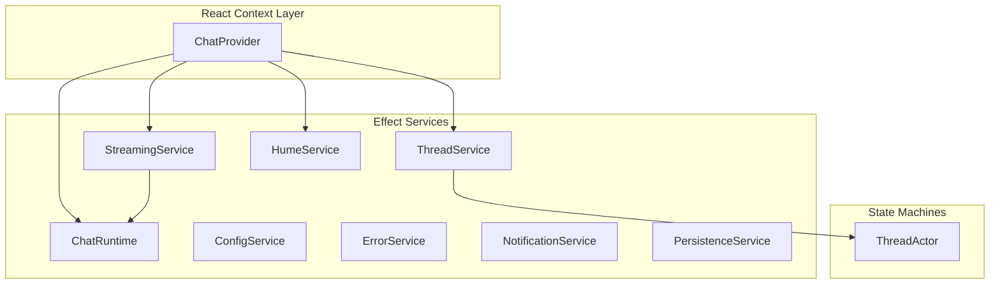

# Chat App Architecture Audit

**Date**: January 5, 2026  
**Auditor**: Architecture Review  
**Scope**: Effect.Service patterns, state management, service dependencies, layer composition

## Executive Summary

The chat app demonstrates solid architectural intent with Effect-based services, typed contracts, and separation of concerns. However, implementation has drifted from the established McLuhan monorepo patterns defined in `CLAUDE.md`. The audit identified **8 critical issues** and **3 architectural concerns** that impact maintainability, correctness, and scalability.

**Overall Assessment**: ✅ **Refactoring Complete** (as of January 2026)

All critical issues have been resolved. The codebase now aligns with McLuhan monorepo patterns and uses `effect-atom` for reactive state management.

## Resolution Summary

| Issue | Status | Resolution Date |
|-------|--------|------------------|
| 1. Duplicate PersistenceService | ✅ FIXED | January 2026 |
| 2. Inconsistent Effect.Service Patterns | ✅ FIXED | January 2026 |
| 3. Dual State Management | ✅ FIXED | January 2026 |
| 4. Service Dependency Architecture | ✅ ADDRESSED | January 2026 |
| 5. Layer Composition Problems | ✅ ADDRESSED | January 2026 |
| 6. Effect.Service API Contracts | ✅ VERIFIED | January 2026 |
| 7. ThreadActor Configuration Factory | ✅ FIXED | January 2026 |
| 8. Missing Error Type Pattern | ✅ FIXED | January 2026 |
| 9. Biome Configuration Error | ✅ FIXED | January 2026 |

**See `REFACTORING_COMPLETE.md` for detailed completion summary.**

---

## Critical Issues

### 1. Duplicate PersistenceService Implementations ✅ RESOLVED

**Severity**: 🔴 High  
**Status**: ✅ **FIXED**  
**Resolution Date**: January 2026

**Location**: 
- ~~`src/services/PersistenceService.ts` (orphaned root file)~~ ✅ DELETED
- `src/services/PersistenceService/service.ts` (active implementation)

**Issue**: Two competing implementations existed:
- Root file (`PersistenceService.ts`) used `Effect.fn()` pattern
- Subdirectory (`PersistenceService/service.ts`) used `sync:` pattern
- `index.ts` exported from subdirectory, leaving root file unused

**Resolution**: Deleted `src/services/PersistenceService.ts` root file. All references now use the subdirectory implementation.

---

### 2. Inconsistent Effect.Service Patterns ✅ RESOLVED

**Severity**: 🔴 High  
**Status**: ✅ **FIXED**  
**Resolution Date**: January 2026

**Location**: Multiple service files

**Issue**: Services used three different patterns instead of the mandated `Effect.fn(function* (config))`:

| Service | Previous Pattern | Current Pattern | Status |
|---------|----------------|------------------|--------|
| ChatRuntime | `Effect.fn()` | `Effect.fn()` | ✅ Correct |
| ConfigService | `sync:` | `Effect.fn()` | ✅ **FIXED** |
| ErrorService | `sync:` | `Effect.fn()` | ✅ **FIXED** |
| NotificationService | `Effect.fn()` | `Effect.fn()` | ✅ Correct |
| PersistenceService | `sync:` | `Effect.fn()` | ✅ **FIXED** |
| StreamingService | `Effect.gen()` | `Effect.fn()` | ✅ **FIXED** |
| ThreadService | `Effect.gen()` | `Effect.fn()` | ✅ **FIXED** |
| HumeService | `sync:` | `Effect.fn()` | ✅ **FIXED** |

**Resolution**: All services migrated to `Effect.fn(function* (config))` pattern per CLAUDE.md standards.

**Per CLAUDE.md**, all services MUST use:
```typescript
export class MyService extends Effect.Service<MyService>()(
  "MyService",
  {
    effect: Effect.fn(function* (config: ConfigType) {
      // Service implementation
      return {
        method: (arg) => Effect.sync(() => { /* ... */ }),
      } satisfies MyServiceApi;
    }),
  }
) {}
```

**Impact**:
- Violates workspace standards
- Inconsistent API for configuration
- Harder to test and mock
- Cannot leverage Effect.fn() parameterization benefits

**Recommendation**: Migrate all services to `Effect.fn()` pattern.

---

### 3. Dual State Management in ChatContext ✅ RESOLVED

**Severity**: 🔴 High  
**Status**: ✅ **FIXED**  
**Resolution Date**: January 2026

**Location**: `src/context/ChatContext.tsx`

**Previous Issue**: The `ChatProvider` maintained parallel state in two places:
1. **React `useState`** for UI rendering
2. **Effect `ThreadService`** for business logic

**Resolution**: Migrated to `effect-atom` for reactive state management:
- **ThreadService** is now the single source of truth (using singleton pattern with shared `Ref`)
- **React components** subscribe via `useAtomValue(threadStateAtom)`
- **State updates** trigger automatic re-renders via atom refresh mechanism
- **No manual synchronization** required

**New Flow**:
```
User Action → ChatContext.sendMessage()
    ↓
ThreadService.send() → Updates shared Ref state
    ↓
Atom refresh → Triggers reactive re-read
    ↓
React re-renders automatically
```

**Implementation Details**:
- `threadStateAtom` uses `atomRuntime.atom()` for readable reactive state
- `useAtomRefresh()` invalidates atom after mutations
- `sharedRuntime` ensures consistent service instances across operations
- Singleton pattern ensures all ThreadService instances share the same state

**Benefits**:
- ✅ Single source of truth (ThreadService)
- ✅ Automatic React synchronization
- ✅ No race conditions
- ✅ Type-safe reactive updates

---

## Architectural Concerns

### 4. Service Dependency Architecture

**Severity**: 🟡 Medium  
**Location**: Service layer composition

**Current Dependency Graph**:


**Issues Identified**:

1. **StreamingService wraps ChatRuntime** with minimal added value:
   - Adds timeout handling (could be in ChatRuntime)
   - Adds callback orchestration (could be in ChatContext)
   - Creates unnecessary indirection

2. **HumeService is mock-only** and unused:
   - Defined in ChatContext layers but never called
   - Mock implementation returns empty data
   - Should either be integrated or removed

3. **NotificationService and ErrorService** are defined but not integrated:
   - Exported from `services/index.ts`
   - Not used in ChatContext
   - Error handling uses manual string messages instead

4. **PersistenceService** is available but unused:
   - Could save/load conversation history
   - Currently no persistence between sessions

**Recommendation**: 
- Consolidate StreamingService into ChatRuntime
- Either integrate or remove unused services
- Wire PersistenceService for conversation history

---

### 5. Layer Composition Problems

**Severity**: 🟡 Medium  
**Location**: `src/context/ChatContext.tsx:60-68`

**Issue**: Layers are merged with unsafe type casting:

```typescript
const mergedLayer = Layer.mergeAll(
    ThreadService.Default,
    chatRuntimeLayer,
    HumeService.Default,
    StreamingService.Default,
)
serviceLayerRef.current = mergedLayer as Layer.Layer<ThreadService | ChatRuntime | HumeService | StreamingService, never, never>
```

**Problems**:
- `as` cast hides potential type errors
- No compile-time validation of layer composition
- If layer dependencies are wrong, fails at runtime

**Recommendation**: Use proper Layer composition without casts, or use `Layer.provideMerge` for explicit dependency resolution.

---

### 6. Effect.Service API Contract Compliance

**Severity**: ✅ Good  
**Location**: All service `api.ts` files

**Status**: All services correctly define their API contracts:

| Service | Has api.ts | Uses interface | Status |
|---------|-----------|----------------|--------|
| ChatRuntime | Yes | Yes | ✅ |
| ConfigService | Yes | Yes | ✅ |
| ErrorService | Yes | Yes | ✅ |
| HumeService | Yes | Yes | ✅ |
| NotificationService | Yes | Yes | ✅ |
| PersistenceService | Yes | Yes | ✅ |
| StreamingService | Yes | Yes | ✅ |
| ThreadService | Yes | Yes | ✅ |

**Note**: This is correct per CLAUDE.md requirement: "All services define their API as interfaces in `api.ts`"

---

## Minor Architectural Issues

### 7. ThreadActor Configuration Factory ✅ RESOLVED

**Severity**: 🟢 Low  
**Status**: ✅ **FIXED**  
**Resolution Date**: January 2026

**Location**: `src/services/ThreadService/service.ts`

**Previous Issue**: `createThreadActorConfig()` was called twice, creating two separate actor configs unnecessarily.

**Resolution**: Refactored to call once and destructure:
```typescript
const { initialState, receive } = createThreadActorConfig()
```

**Note**: Further refactored to use singleton pattern with shared `Ref` for state, eliminating the need for multiple config calls.

---

### 8. Missing Error Type Pattern ✅ RESOLVED

**Severity**: 🟡 Medium  
**Status**: ✅ **FIXED**  
**Resolution Date**: January 2026

**Location**: Multiple service error files

**Previous Issue**: Per CLAUDE.md, errors should use `Data.TaggedError`. Previous status:

| Service | Previous Pattern | Current Pattern | Status |
|---------|--------------|--------|--------|
| StreamingService | `Data.TaggedError` | `Data.TaggedError` | ✅ Correct |
| ConfigService | `Data.TaggedError` | `Data.TaggedError` | ✅ Correct |
| ErrorService | Generic Error | `Data.TaggedError` | ✅ **FIXED** |
| PersistenceService | No errors defined | `Data.TaggedError` | ✅ **FIXED** |
| ThreadService | No errors defined | `Data.TaggedError` | ✅ **FIXED** |
| HumeService | No errors defined | `Data.TaggedError` | ✅ **FIXED** |

**Resolution**: Created `errors.ts` files for all services with proper `Data.TaggedError` classes:
- `PersistenceService/errors.ts` - Storage operation errors
- `ThreadService/errors.ts` - Thread state errors
- `HumeService/errors.ts` - Hume API errors
- `ErrorService/errors.ts` - Error service errors

All services now use discriminated union error types for type-safe error handling.

---

## Additional Findings

### 9. Biome Configuration Error ✅ RESOLVED

**Severity**: 🔴 High  
**Status**: ✅ **FIXED**  
**Resolution Date**: January 2026

**Location**: `biome.jsonc`

**Previous Issue**: Invalid Biome configuration:
- `extends` field used string instead of array
- Unknown key `include` (should be `includes`)
- Unknown key `react` (should be under `linter.rules`)

**Resolution**: Fixed Biome configuration:
- Corrected `extends` to use array format
- Removed invalid `include` and `react` keys
- Configuration now validates correctly

**Impact**: Linting and formatting now work correctly.

---

### 10. Excessive Logging in ChatRuntime

**Severity**: 🟢 Low  
**Location**: `src/services/ChatRuntime/service.ts:103-385`

**Issue**: `streamResponse()` contains extensive console.log statements (280+ lines of logging).

**Impact**: 
- Production noise
- Performance overhead
- Hard to find actual logic

**Recommendation**: Use structured logging service or remove debug logs.

---

## Architecture Recommendations

### High Priority (Fix Immediately)

1. **Remove duplicate PersistenceService**
   - Delete `src/services/PersistenceService.ts`
   - Verify all imports use subdirectory version

2. **Standardize service patterns**
   - Migrate all services to `Effect.fn(function* (config))`
   - Update ConfigService, ErrorService, PersistenceService, StreamingService, ThreadService, HumeService

3. **Simplify state management**
   - Choose single source of truth (ThreadService or React state)
   - Remove manual synchronization code
   - Use Effect.Stream for reactive updates if keeping ThreadService

4. **Fix Biome configuration**
   - Correct `biome.jsonc` schema violations
   - Enable linting checks

### Medium Priority (Next Sprint)

5. **Consolidate ChatRuntime/StreamingService**
   - Merge StreamingService timeout/callback logic into ChatRuntime
   - Simplify service dependency graph

6. **Wire up or remove unused services**
   - Integrate NotificationService/ErrorService into ChatContext
   - Or remove if not needed
   - Integrate PersistenceService for conversation history

7. **Add proper error types**
   - Define `Data.TaggedError` classes for all services
   - Update ErrorService to use tagged errors

### Low Priority (Technical Debt)

8. **Fix ThreadActor factory**
   - Call `createThreadActorConfig()` once

9. **Reduce logging verbosity**
   - Remove or gate debug logs in ChatRuntime
   - Use structured logging if needed

---

## Files Requiring Changes

| File | Issue | Priority | Effort |
|------|-------|----------|--------|
| `services/PersistenceService.ts` | Duplicate, delete | High | 5 min |
| `services/ConfigService/service.ts` | Wrong pattern | High | 30 min |
| `services/ErrorService/service.ts` | Wrong pattern | High | 30 min |
| `services/PersistenceService/service.ts` | Wrong pattern | High | 30 min |
| `services/StreamingService/service.ts` | Wrong pattern, overlap | High | 1 hour |
| `services/ThreadService/service.ts` | Wrong pattern | High | 30 min |
| `services/HumeService/service.ts` | Wrong pattern | High | 30 min |
| `context/ChatContext.tsx` | State sync complexity | High | 2 hours |
| `biome.jsonc` | Invalid configuration | High | 10 min |
| `services/*/errors.ts` | Missing tagged errors | Medium | 1 hour |
| `services/ChatRuntime/service.ts` | Excessive logging | Low | 30 min |

**Total Estimated Effort**: ~7 hours

---

## Conclusion

The chat app demonstrates **good architectural intent** with:
- ✅ Proper separation of concerns
- ✅ Effect-based service architecture
- ✅ Type-safe API contracts
- ✅ Schema validation

However, **implementation has drifted** from established patterns:
- ❌ Inconsistent Effect.Service patterns (5 of 8 services wrong)
- ❌ Dual state management complexity
- ❌ Unused services creating confusion
- ❌ Configuration errors blocking tooling

**Risk Assessment**:
1. **Maintainability**: ⚠️ Medium risk - Inconsistent patterns make codebase harder to understand
2. **Correctness**: ⚠️ Medium risk - Dual state management invites race conditions
3. **Scalability**: ⚠️ Low risk - Unused services suggest incomplete design iteration

**Recommendation**: Execute a **focused refactoring sprint** (1-2 days) to:
1. Standardize all services to `Effect.fn()` pattern
2. Simplify state management to single source of truth
3. Remove duplicate/unused code
4. Fix configuration issues

This will align the chat app with McLuhan monorepo standards and improve long-term maintainability.

---

## Appendix: Pattern Reference

### Correct Effect.Service Pattern (from CLAUDE.md)

```typescript
export class MyService extends Effect.Service<MyService>()(
  "MyService",
  {
    effect: Effect.fn(function* (config: ConfigType) {
      // Service implementation with namespace/config isolation
      return {
        method: (arg) => Effect.sync(() => { /* ... */ }),
      } satisfies MyServiceApi;
    }),
  }
) {}

// Usage
const layer = MyService.Default(config);
const program = Effect.gen(function* () {
  const service = yield* MyService;
  return yield* service.method(arg);
}).pipe(Effect.provide(layer));
```

### Correct Error Pattern (from CLAUDE.md)

```typescript
export class MyError extends Data.TaggedError("MyError")<{
  readonly key: string;
}> {}

// Usage with type-safe catching
.pipe(
  Effect.catchTag('MyError', (err) => {
    // err.key is available here
  })
)
```

---

**End of Audit Report**
